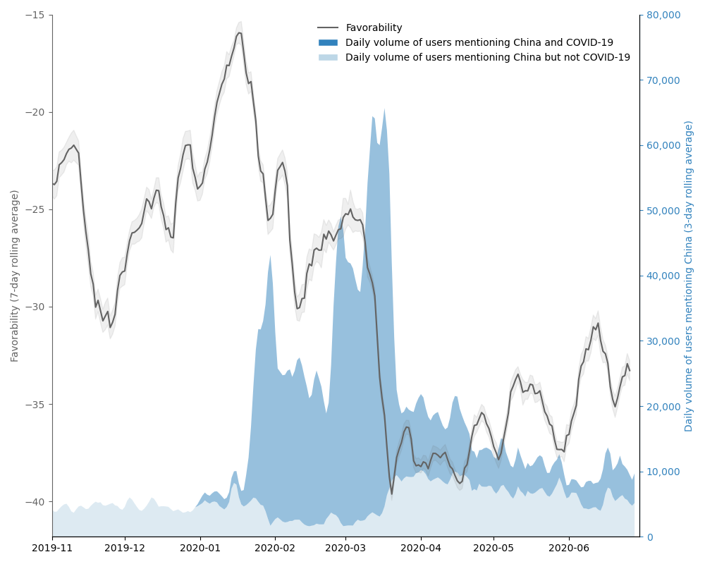
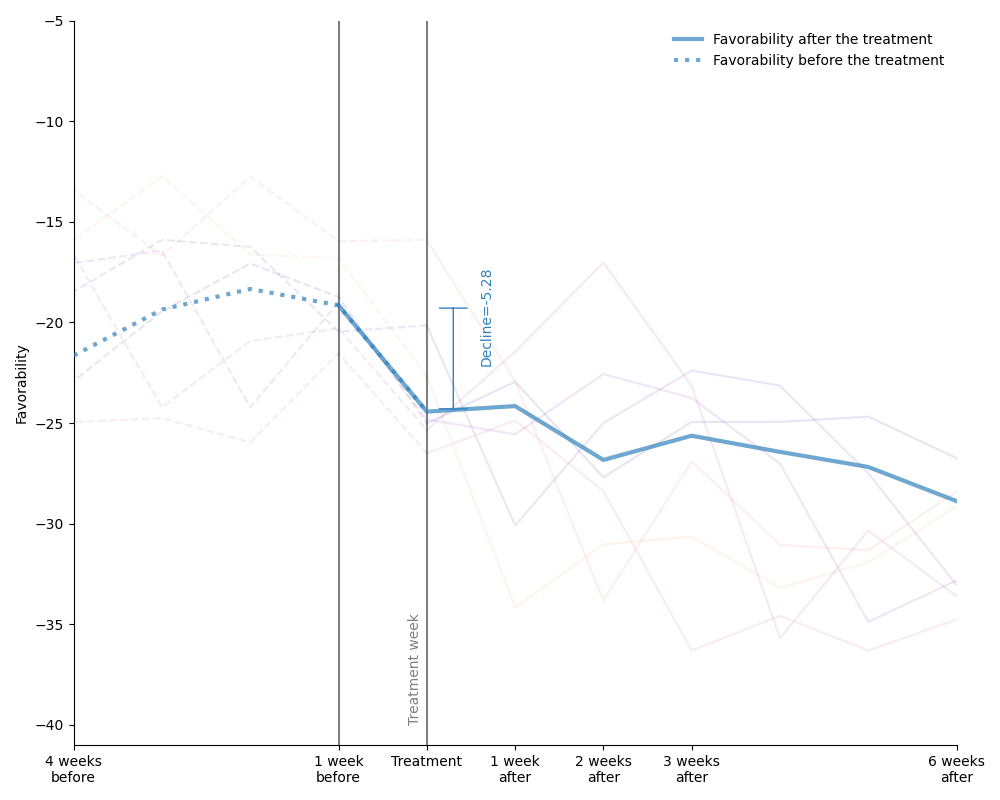
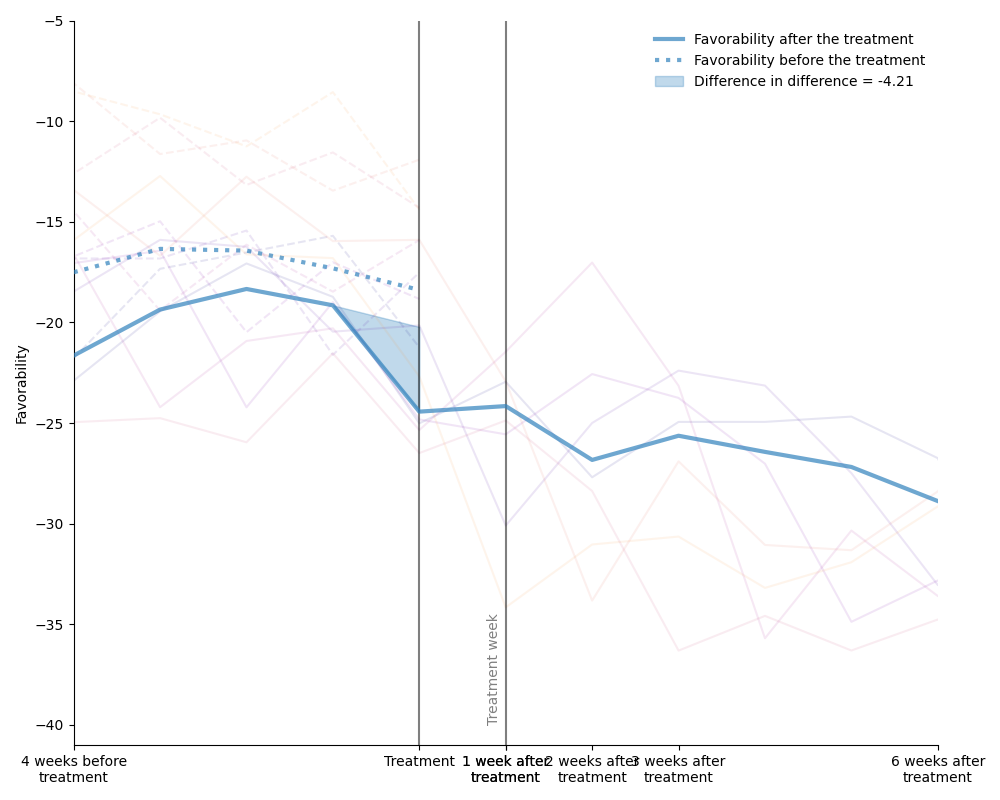

# How COVID-19 has Impacted American Attitudes Toward China: A Study on Twitter

Past research has studied social determinants of attitudes toward foreign countries. Confounded by potential endogeneity biases due to unobserved factors or reverse causality, the causal impact of these factors on public opinion is usually difficult to establish. Using social media data, we leverage the suddenness of the COVID-19 pandemic to examine whether a major global event has causally changed American views of another coun- try. We collate a database of more than 297 million posts on the social media platform Twitter about China or COVID-19 up to June 2020, and we treat tweeting about COVID-19 as a proxy for individual awareness of COVID-19. Using regression discontinuity and difference-in-difference estimation, we find that awareness of COVID-19 causes a sharp rise in anti-China attitudes. Our work has implications for understanding how self-interest affects policy preference and how Americans view migrant communities. This reponsitory publicly releases data and necessary code to replicate this research study under Creative Commons Zero v1.0 Universal license.

[Cook, Gavin, Junming Huang, and Yu Xie. "How COVID-19 has impacted american attitudes toward china: A study on twitter." arXiv preprint arXiv:2108.11040 (2021).](https://arxiv.org/abs/2108.11040)

# Data collection and attitude quantification
Social media data are collected from Twitter public messages and profiles. We use an open-source tool to search tweets containing China-related related keywords. Specifically, we search for tweets containing any mention of the words “China,” “Chinese,” “Wuhan,” and “Beijing” from January 2017 to June 2020, and exclude COVID-related tweets listed in an open library of near 100 million COVID-19 related tweets [[Chen et al. 2020]](https://github.com/echen102/COVID-19-TweetIDs). We end up with 68,979,579 unique English-language tweets mentioning China but not COVID-19, with time stamps and anonymized user identifiers. We search Twitter users who have voluntarily revealed geographic information on their profiles and used Google Maps to identify those located in the US, and focus on 174,187 users who (1) are living in the US and (2) have posted at least one tweet about China per month from January to April 2020. 

Twitter user sentiments are quantitatively inferred with [BERT](https://github.com/google-research/bert), an open-source state-of-the-art natural language processing model of deep neural networks. We first employed eight research assistants to manually label 5,000 English-language tweets with expressed China-related sentiments, represented as integer-valued favorability scores from -2 (most unfavorable), -1 (somewhat unfavorable), 0 (neutral), 1 (somewhat favorable), 2 (most favorable). We then used the labeled tweets to fine-tune a pretrained BERT model to learn a mapping from tweet text to integer favorability score at an accuracy of 95.3%, which in turn assigns favorability scores to all English tweets in the entire corpus. Then we proportionally map the scores from [−2, 2] to [−100, 100] for intuitive presentation. To accurately reflect the attitude of an average American Twitter user, we report a two-stage daily average: we first calculate the daily average sentiment toward China for every individual user and then average over all individuals to obtain the daily attitude of the population.

# Declining sentiment with increasing tweet volume on China
Americans’ attitude toward China has been declining from a stable level to a 3-year low of -38 after the outbreak of COVID-19. The attitude is measured as macro average over Twitter users on tweets mentioning China but not COVID-19, on a 7-day sliding smooth window. Sudden and deep declines are observed nationwide. The declines are accompanied by a sharp and sudden increase in the popularity of China topic on Twitter (light and dark blue areas), with the daily number of users mentioning China increased from 5,096 in late Dec 2019 to 66,535 in mid-March 2020. On March 16, over 95% Twitter users who mention China also mention COVID-19. Data are available at [covid1-trend.csv](data/covid1-trend.csv).

# Identifying causality and quantifying treatment effects
The coincidence of the outbreak of COVID-19 and the rise of anti-China sentiment on social media is remarkable with two hypotheses: a causal hypothesis that attributes the rise in anti-China attitudes to the outbreak of COVID-19 and a non-causal hypothesis that posits a mere association between the two. We use regression discontinuity and difference-in-difference estimation to adjudicate between these hypotheses. For every Twitter user in our data, each of the two strategies analyzes whether COVID-19 changed their attitude toward China. We find that awareness of COVID-19 causes a rise in anti-China sentiment.

Regression discontinuity. The average sentiment of China-related tweets before and after the adoption date, when a Twitter user first posts a tweet mentioning COVID-19. Individuals are broken down by their treatment week, shown in gray lines. Data are available at [covid1-effect-rd.csv](data/covid1-effect-rd.csv).

Difference in difference. The Twitter users express a suddenly declining sentiment toward China in the treatment week when they first post a tweet about COVID-19 (solid). In contrast, the counterfactual group who have not yet been treated in this week, keep almost the same level of sentiment toward China (dotted). The treatment effect is estimated with the difference across the two groups in the difference before and after the treatment week, suggesting an immediate decline of 4.21 in sentiment caused by COVID-19. Data are available at [covid1-effect-did.csv](data/covid1-effect-did.csv).

# Citation
Please cite this paper if the data and results help your research: 
[Cook, Gavin, Junming Huang, and Yu Xie. "How COVID-19 has impacted american attitudes toward china: A study on twitter." arXiv preprint arXiv:2108.11040 (2021).](https://arxiv.org/abs/2108.11040)